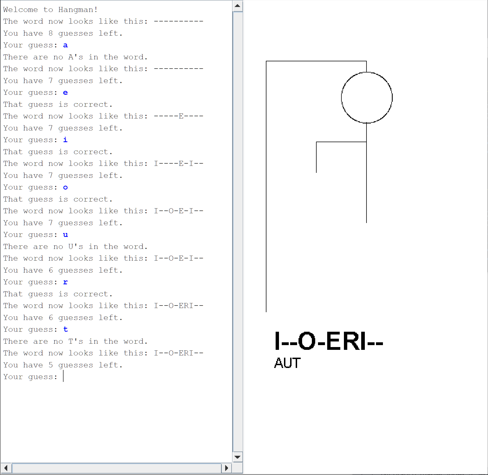

# Hangman Game

This is an implementation of the word game [Hangman](https://en.wikipedia.org/wiki/Hangman_(game)) coded in Java.

The ACM Java library can be found [here](https://jtf.acm.org/). The `HangmanLexicon.txt` dictionary and starter code are sourced from [Stanford Engineering Everywhere - CS106A - Programming Methodology](https://see.stanford.edu/Course/CS106A).

## Instructions
1. Run `javac -cp acm.jar HangmanCanvas.java Hangman.java` to compile.
2. For Windows, run `java -cp ".;acm.jar" Hangman` to play the game.  
For Unix, run `java -cp .:acm.jar Hangman`.

## Screenshot of Demo Play

    

